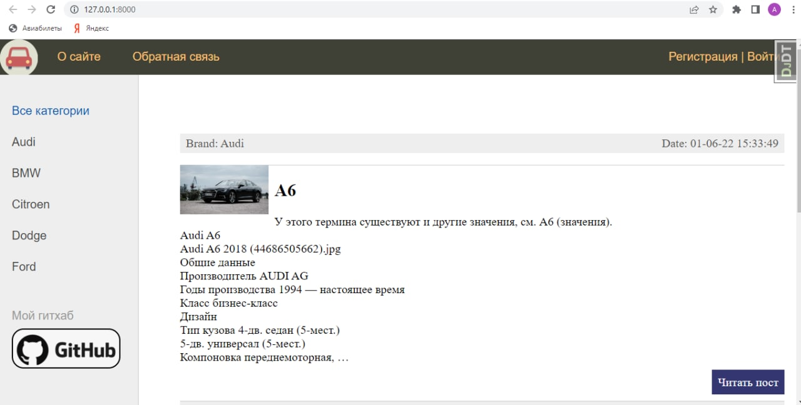
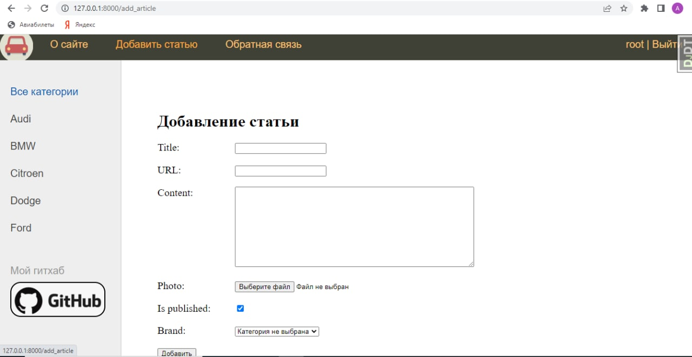

<h3>Requirements: </h3>
<ul>
    <li>Python 3.10.4</li>
    <li>Django 4.0.4</li>
    <li>django-simple-captcha 0.5.17</li>
</ul>
<h3>Install: </h3>
<ul>
<li>git clone https://github.com/AndreiMnkvch/django-cars-site.git</li>
or
<li>git clone git@github.com:AndreiMnkvch/django-cars-site.git</li>
<li>cd django-cars-site</li>
    <li>python -m venv venv</li>
    <li>cd venv\Scripts\</li>
    <li>activate</li>
    <li>cd ..\..\src\</li>
    <li>pip install -r requirements.txt</li>
    <li>py manage.py runserver</li>
    <li>enjoy ;)</li>

</ul>
<h3>Usage: </h3>
Here you can find special features about your favourite car.
Choose a brand at the left side and enjoy numerous articles about different models  
of this brand.

There is an opportunity to contribute to for registered users only.
All you need is to sign up at the right up side. And new "Add Article" bar will appear at the navigation bar. 

Here, after filling in the fields, click the submit button and your post will immediately be displayed in the 
corresponding group of posts.
Besides, user always can leave a feedback on the Feedback bar.   
To do this, you need to fill in all the fields and the message log will immediately come to the developers team.

    
